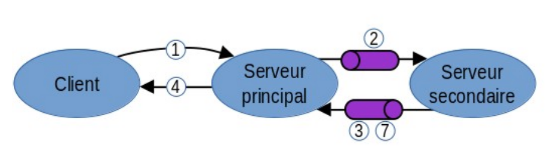
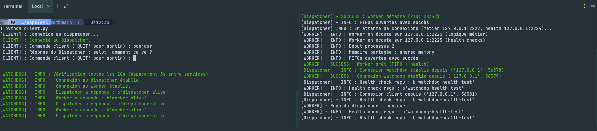

# Système et programmation sécurisée - Projet

DA COSTA VEIGA Adrien  
DESERT Lorick  

INSA Hauts-de-France  
FISA 4 - Informatique et Cybersécurité  
2025 - 2026

## Choix techniques

Nous avons fait le choix de lancer le Worker depuis le Dispatcher. Nous ne disposons que d'un unique Worker, cela nous paraîssait être le plus adéquat du fait de la relation entre le Dispatcher et le Worker.

Nous avons également fait le choix de ne pas lancer le Dispatcher ni le Worker depuis le Watchdog de sorte à laisser la solution de monitoring relativement indépendante et ouverte à d'autres solutions.

Architecture Dispatcher-Worker : `Protocole "basique"`.



## Lancer les programmes

Au besoin, activer l'environnement Python
```bash
source ./.venv/bin/activate
```

Se placer dans le répertoire `src`:
```bash
cd src/
```

Le Dispatcher se charge de lancer le Worker, il est nécessaire d'exécuter le programme `dispatcher.py` avant les autres programmes. Il n'est pas nécessaire d'exécuter manuellement le programme `worker.py"

Exécuter le programme `dispatcher.py`:
```bash
python3 dispatcher.py
```

L'ordre d'exécution des programmes `watchdog.py` et `client.py` n'a pas d'importance.

Exécuter le programme `watchdog.py`:
```bash
python3 watchdog.py
```

Exécuter le programme `client.py`:
```bash
python3 client.py
```

Exécuter le programme `stop_all.py`:
```bash
python3 stop_all.py
```

Si la commande `python3` ne fonctionne pas, essayer activer l'environnement Python et utiliser la commande `python`.

## Informations utiles

Le Watchdog redémarre le Dispatcher dans le cas où ce dernier ou bien le Worker rencontre un problème. Le nouveau Dispatcher et le nouveau Worker sont relancés en arrière plan pour éviter que le signal CTRL + C ne tue le Watchdog par la
même occasion ou inversement. Etant donné qu'il n'est pas possible d'attacher un terminal à un processus lancer en arrière plan, le programme `stop_all.py` permet de stopper en toute sécurité les processus du Dispatcher et du Worker.

Le Client peut se connecter à tout moment tant que le Dispatcher, et par conséquent le Worker, sont démarrés.

Le Watchdog peut se connecter à tout moment tant que le Dispatcher, et par conséquent le Worker, sont démarrés

Le Worker peut réaliser les traitements suivants :
- Client envoie "ping" -> Réponse : "pong"
- Client envoie "pong" -> Réponse : "ping"
- Client envoie "bonjour" -> Réponse : "salut, comment ca va ?"
- Client envoie une autre commande que celles précisées ci-dessus : Réponse : "Instruction non comprise"


Résultat final